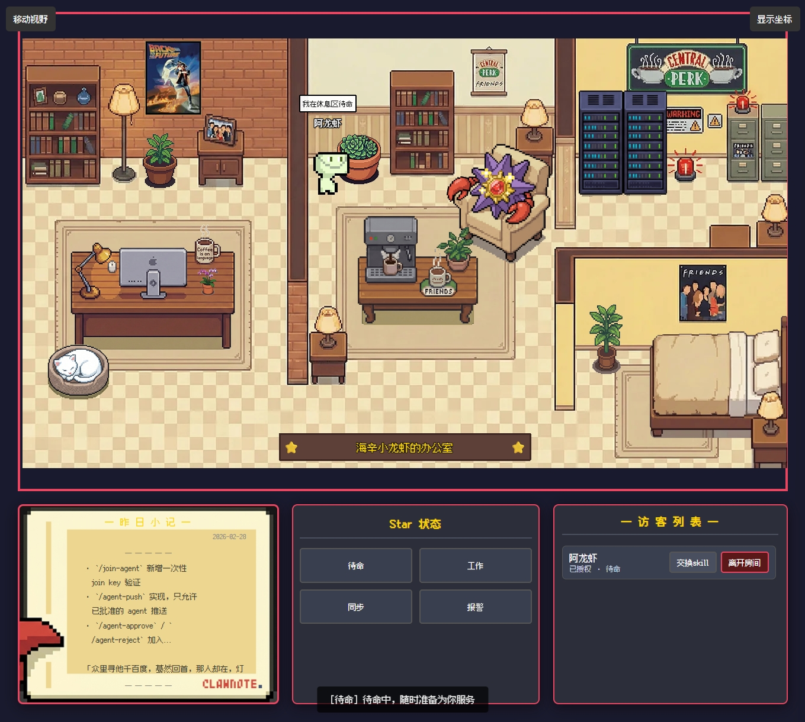

# auto-install-Openclaw

<p align="center">
  
</p>

<p align="center">
  <strong>OpenClaw 自动安装、配置修复与像素化工作台整合方案</strong><br />
  把命令行部署、官方模型接入、插件治理、技能包同步、配置修复、像素小屋工作台收敛到一个仓库里。
</p>

<p align="center">
  
  
  
  
  
</p>

> [!IMPORTANT]
> 这个仓库现在不是单纯的安装脚本，而是一个完整的 OpenClaw 落地方案：
> `安装器 + 配置菜单 + 配置修复 + 本地 Skills 仓 + 像素小屋工作台 + 角色化配置入口`。

## 快速入口

### 1. 一键安装

```bash
curl -fsSL --proto '=https' --tlsv1.2 --connect-timeout 8 --max-time 25 https://gitee.com/leecyno1/auto-install-openclaw/raw/main/install.sh | bash
```

### 2. 全自动安装

```bash
curl -fsSL --proto '=https' --tlsv1.2 --connect-timeout 8 --max-time 25 https://gitee.com/leecyno1/auto-install-openclaw/raw/main/install.sh | bash -s -- --auto-confirm-all
```

### 3. 安装后打开配置中心

```bash
bash ~/.openclaw/config-menu.sh
```

### 4. 修复历史错误配置并保留记忆/对话

```bash
bash ~/.openclaw/config-menu.sh --repair-config
```

### 5. 补装或修复像素小屋工作台

```bash
bash ~/.openclaw/config-menu.sh --install-pixel-house
```

## 这套东西解决什么问题

- 把 OpenClaw 首次部署压缩成一条可重复执行的流程，减少环境差异、版本漂移和手工误配。
- 保留官方模型配置流程，不再用脚本硬接管 `openclaw onboard`，但会在进入前自动修复已知坏配置。
- 自动清理历史残留插件项，避免 `pairing required`、`plugin not found`、`unknown channel id` 这类老问题反复出现。
- 默认内置本地 Skills 仓，尽量避免安装时依赖外网动态拉取，降低大规模部署的不确定性。
- 提供像素小屋工作台，把角色、技能、装备、状态、任务和 OpenClaw 后端配置映射到可视化页面。

## 视觉预览

### 配置中心与模型配置

| 配置中心 | 模型配置 |
| --- | --- |
|  |  |

| 消息与测试 | 像素小屋工作台 |
| --- | --- |
|  |  |

### 像素小屋与工作台

| 运行世界 | 房屋场景 |
| --- | --- |
|  |  |

<p align="center">
  
</p>

## 核心能力

| 模块 | 现在能做什么 |
| --- | --- |
| 安装器 | 安装 OpenClaw、依赖、默认运行环境、配置入口、像素小屋启动器 |
| 配置菜单 | 模型配置、官方插件管理、权限设置、技能管理、身份配置、服务管理、配置修复 |
| 配置修复 | 清理历史残留插件/错误渠道配置，保留用户 Memory、Session、对话历史与 API Key |
| Skills 仓 | 内置基础 / 扩展 / 超级技能包，支持本地同步、缓存重建、缺失修复 |
| 像素小屋 | 默认工作台端口 `19000`，映射角色、技能、装备、状态与后端运行世界 |
| Gateway | 默认收敛到 `127.0.0.1:13145`，降低误暴露风险 |

## 档位规则

| 档位 | 请求预算 | 总 Token | 单次 Token | 默认策略 |
| --- | --- | --- | --- | --- |
| 基础档 `low` | 每 5 小时 100 次 | 600000 | 24000 | 基础技能包，适合轻量部署与低成本值守 |
| 扩展档 `medium` | 每 5 小时 300 次 | 2400000 | 48000 | 扩展技能包，默认启用高级模型路由 |
| 超级档 `high` | 请求次数不限 | 6000000 | 80000 | 超级技能包，请求数不限，但仍受 Token 预算与安全规则约束 |

> [!TIP]
> 超级档的“请求次数不限”在策略文件里会写成 `maxRequests=0`，约定 `0` 表示不限，不表示禁用。

## 默认技能包摘录

### 基础档常用技能

| Skill | 作用 |
| --- | --- |
| `agent-browser` | 用结构化命令驱动浏览器，适合网页登录、抓取、点选与自动化操作。 |
| `agentmail` | 给代理分配独立邮箱收发信，适合邮件自动化、附件处理和草稿审批。 |
| `minimax-web-search` | 走 MiniMax MCP 的联网搜索链路，处理最新资讯、资料检索和网页信息获取。 |
| `nano-pdf` | 用自然语言编辑 PDF，适合改字、补内容、调整 PDF 文件。 |
| `content-strategy` | 做内容规划、选题设计、栏目结构和内容路线图。 |
| `social-content` | 生成和优化社媒内容，适合微博、X、LinkedIn、短内容分发。 |
| `media-downloader` | 按描述搜索并下载图片、视频素材，可用于找图和拉取视频片段。 |
| `lark-calendar` | 管理飞书日历和待办，支持事件创建、更新和人员解析。 |
| `notebooklm-skill` | 直接查询 NotebookLM 笔记库，拿到基于来源引用的问答结果。 |
| `ai-image-generation` | 统一走多模型生图能力，适合封面、配图、营销图和视觉草稿。 |

### 扩展 / 超级档重点技能

| Skill | 作用 |
| --- | --- |
| `paperless-docs` | 对接 Paperless-ngx 文档库，检索、上传、打标签、回收文档资料。 |
| `oracle` | 把代码和提示词打包给第二模型复核，适合调试、重构和设计检查。 |
| `planning-with-files` | 复杂任务走文件化规划，自动拆出计划、发现和进度文件。 |
| `baoyu-slide-deck` | 根据内容自动生成演示稿页面和配套视觉。 |
| `baoyu-markdown-to-html` | 把 Markdown 转成更适合微信公众号等渠道分发的 HTML。 |
| `baoyu-post-to-wechat` | 直接把内容整理后推送到公众号工作流。 |

> [!TIP]
> 更完整的技能列表、是否默认安装、是否需要 API Key，请看 [docs/skills-guides.md](docs/skills-guides.md) 和 [skills/default/DEFAULT_SKILLS.md](skills/default/DEFAULT_SKILLS.md)。

## 推荐工作流

```text
安装脚本 -> 官方 onboard -> 配置菜单 -> 修复旧配置 -> 同步本地技能包 -> 启动 Gateway -> 打开像素小屋工作台
```

### 建议顺序

1. 先运行安装脚本，完成 OpenClaw 与依赖初始化。
2. 安装后执行 `bash ~/.openclaw/config-menu.sh`，走一次模型配置与服务检查。
3. 对历史服务器执行 `bash ~/.openclaw/config-menu.sh --repair-config`，刷新本地技能缓存并修复旧配置。
4. 需要可视化界面时执行 `bash ~/.openclaw/config-menu.sh --install-pixel-house`，然后访问 `http://127.0.0.1:19000/`。

## 仓库结构

```text
.
├── install.sh                          # 主安装脚本
├── config-menu.sh                      # 配置中心
├── docs/                               # 配套文档
├── skills/default/                     # 本地默认技能仓
├── scripts/                            # 启动器、同步器、像素小屋桥接脚本
├── photo/                              # README 与文档展示素材
└── subprojects/lobster-sanctum-ui/     # 像素小屋 / Lobster Sanctum Studio
```

## 常用命令

### 配置与修复

```bash
bash ~/.openclaw/config-menu.sh
bash ~/.openclaw/config-menu.sh --repair-config
bash ~/.openclaw/config-menu.sh --install-pixel-house
```

### Gateway

```bash
source ~/.openclaw/env && openclaw gateway status
source ~/.openclaw/env && openclaw doctor
source ~/.openclaw/env && openclaw health
```

### 像素小屋

```bash
~/.openclaw/lobster-world.sh start
~/.openclaw/lobster-world.sh status
~/.openclaw/lobster-world.sh stop
```

## 相关文档

- [渠道配置总览](docs/channels-configuration-guide.md)
- [飞书配置说明](docs/feishu-setup.md)
- [规则档位说明](docs/vendor-control-profiles.md)
- [技能指南汇总](docs/skills-guides.md)
- [人格角色设计](docs/persona-roles.md)
- [像素小屋与工作台设计](docs/roadmaps/2026-03-26-pixel-house-workbench-design.md)

## 适合谁

- 需要在多台服务器上批量部署 OpenClaw 的用户
- 不想每台机器都手动装插件、配模型、修坏配置的用户
- 希望把角色、技能、工具与后端运行状态做成可视化工作台的用户
- 希望把安装、配置、修复、升级统一进一个仓库管理的人

## License

MIT
