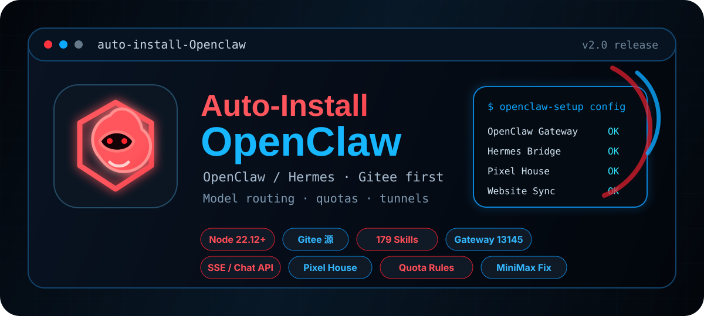
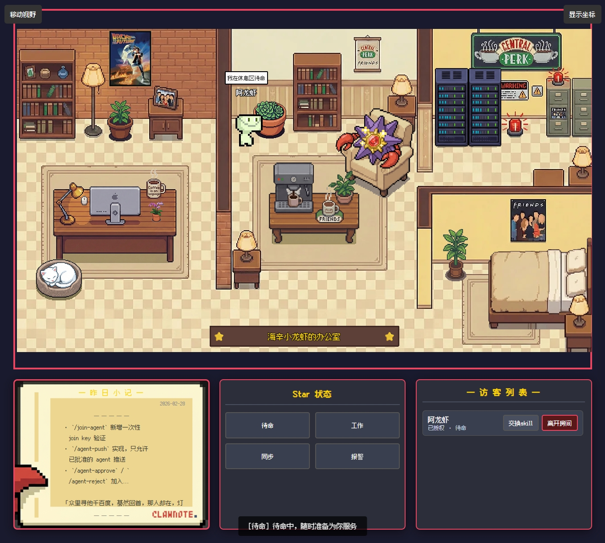

# 大圣之怒 OpenClaw / Hermes 安装器

<p align="center">
  
</p>

<p align="center">
  <strong>OpenClaw / Hermes 双轨全功能安装与配置方案</strong><br />
  官方优先安装 + 自定义 Provider 补丁 + Boutique Skills 同步 + 像素小屋 + 网站联动
</p>

<p align="center">
  
  
  
  
  
  
</p>

> [!IMPORTANT]
> **大圣之怒全功能安装器**：默认优先走官方 OpenClaw / Hermes 安装链路，自定义 URL、Key、模型、路由、生图和像素小屋只作为补丁层写入，避免重复 Provider 和历史脏配置。
> - **双轨入口**：`install-openclaw.sh` 安装 OpenClaw，`install-hermes.sh` 安装 Hermes，`install.sh --engine both` 作为高级兼容入口。
> - **统一命令**：主入口是 `openclaw-setup`，`lobster-setup` 仅作为兼容别名。
> - **批量部署**：支持 `--auto-confirm-all`、`--provider`、`--model`、`--api-key`、`--base-url`、`--image-model`、`--image-api-key`、`--image-base-url`、`--enable-advanced-routing` 等全自动参数。
> - **网站联动**：同步 `19000` 像素小屋、`13145` OpenClaw Dashboard、`9119` Hermes Dashboard、`8000` Hermes OpenAI 兼容聊天接口、`13146` 健康检查和终端 bootstrap。

## 快速入口

> 当前最新验证分支：`release/hermes-website-minimax-hardening-20260503`。上述命令默认拉取该分支，包含 Hermes `8000` OpenAI 兼容聊天桥、SSE 流式修复、官方 MiniMax 清理逻辑和网站对接修复。若需要稳定主分支版本，可将 URL 中的 `release/hermes-website-minimax-hardening-20260503` 改为 `main`。


### 1. 一键安装（推荐双入口）

```bash
# OpenClaw
curl -fsSL https://gitee.com/leecyno1/auto-install-openclaw/raw/release/hermes-website-minimax-hardening-20260503/install-openclaw.sh | bash

# Hermes
curl -fsSL https://gitee.com/leecyno1/auto-install-openclaw/raw/release/hermes-website-minimax-hardening-20260503/install-hermes.sh | bash

# 双引擎
curl -fsSL https://gitee.com/leecyno1/auto-install-openclaw/raw/release/hermes-website-minimax-hardening-20260503/install.sh | bash -s -- --engine both

# 兼容总入口
curl -fsSL https://gitee.com/leecyno1/auto-install-openclaw/raw/release/hermes-website-minimax-hardening-20260503/install.sh | bash -s -- --engine openclaw
curl -fsSL https://gitee.com/leecyno1/auto-install-openclaw/raw/release/hermes-website-minimax-hardening-20260503/install.sh | bash -s -- --engine hermes
curl -fsSL https://raw.githubusercontent.com/leecyno1/auto-install-Openclaw/release/hermes-website-minimax-hardening-20260503/install.sh | bash
curl -fsSL https://mirror.ghproxy.com/https://raw.githubusercontent.com/leecyno1/auto-install-Openclaw/release/hermes-website-minimax-hardening-20260503/install.sh | bash
```

全自动示例：

```bash
curl -fsSL https://gitee.com/leecyno1/auto-install-openclaw/raw/release/hermes-website-minimax-hardening-20260503/install-openclaw.sh | bash -s -- \
  --auto-confirm-all \
  --provider minimax \
  --model MiniMax-M2.7-highspeed \
  --api-key "$MINIMAX_API_KEY" \
  --base-url https://api.minimaxi.com/anthropic \
  --image-model gemini-3.1-flash-image-preview \
  --image-api-key "$IMAGE_API_KEY" \
  --image-base-url https://api.viviai.cc/v1/chat/completions \
  --rule-profile medium \
  --install-skills extended \
  --install-pixel-house \
  --enable-advanced-routing \
  --extra-model "id=gpt-5-5,name=GPT-5.5,base_url=https://yfy.zhouyang168.top/v1,api_key=$GPT55_API_KEY,model=gpt-5.5,api_type=openai-completions,image_tool=responses-image-generation,image_model=gpt-image-2"
```

可重复追加多个可选模型：

```bash
./install-openclaw.sh --auto-confirm-all \
  --provider minimax --model MiniMax-M2.7 --api-key "$MINIMAX_API_KEY" --base-url https://api.minimaxi.com/v1 --api-type openai-completions \
  --extra-model "id=gpt-5-5,name=GPT-5.5,base_url=https://yfy.zhouyang168.top/v1,api_key=$GPT55_API_KEY,model=gpt-5.5,api_type=openai-completions,image_tool=responses-image-generation,image_model=gpt-image-2" \
  --extra-model "id=gpt-5-4,name=GPT-5.4,base_url=https://yfy.zhouyang168.top/v1,api_key=$GPT55_API_KEY,model=gpt-5.4,api_type=openai-completions"
```

`image_tool=responses-image-generation` 会把图片能力记录到 `~/.openclaw/model-capabilities.json`：这条链路使用 `/v1/responses` + `tools:[{"type":"image_generation"}]`，适用于 `gpt-5.5` 可生成图片但 `/v1/images/generations` 无可用渠道的网关。

多模型会统一进入内部注册表和能力目录：

- **家族槽位唯一**：`minimax` / `deepseek` / `glm` / `gpt` / `image` / `video` 每个槽位只保留最后一次声明的激活 provider，被替换的同族 provider 记录到 `archivedProviders`，避免 OpenClaw/provider 列表反复堆积重复项。
- **能力目录**：`~/.openclaw/model-capabilities.json` 同时记录文本、图片、视频能力，以及 `gpt-5.5` 这类 “文本模型 + Responses image_generation tool” 链路的可用端点和不可用 fallback。
- **规则路由**：默认 `OPENCLAW_ROUTER_BACKEND=embedded`、`OPENCLAW_ROUTER_STRATEGY=rules`，主模型处理主任务，辅助模型用于摘要、分类、改写、代码审阅和媒体生成。
- **外部后端预留**：配置结构预留 `litellm` / `bifrost` / `portkey`，但默认不安装外部网关；RouteLLM 仅作为后续算法参考。

安装脚本也会自动做分区和流量保护：

- **数据盘优先**：如果检测到可写的 `/data`，默认使用 `/data/openclaw-storage` 保存备份、升级备份、root 缓存、配额状态和 Node 编译缓存，降低系统盘压力。
- **未来备份落盘**：`~/.openclaw/backups`、`~/.openclaw-upgrade-backups`、`~/.cache` 会在数据盘可用时迁移为软链接；可用 `OPENCLAW_DATA_ROOT` 指定其它目录，或 `OPENCLAW_DATA_DISK_AUTO=0` 关闭自动探测。
- **内置流量控制**：默认写入 `OPENCLAW_TRAFFIC_CONTROL_ENABLED=1` 和 `OPENCLAW_QUOTA_ENFORCER_MODE=embedded`，并按规则档位设置文本、图片、视频请求窗口配额；默认不启用外部网关。

推荐组合示例：MiniMax 做主任务，GPT-5.5 负责高质量推理和 Responses 图片工具，DeepSeek/GLM 作为低成本辅助槽位：

```bash
./install-openclaw.sh --auto-confirm-all \
  --provider minimax --model MiniMax-M2.7 --api-key "$MINIMAX_API_KEY" --base-url https://api.minimaxi.com/v1 --api-type openai-completions \
  --extra-model "id=deepseek-v4,provider=deepseek,model=DeepSeek-V4,base_url=https://api.deepseek.com/v1,api_key=$DEEPSEEK_API_KEY,api_type=openai-completions" \
  --extra-model "id=glm-5-1,provider=zai,model=glm-5.1,base_url=https://open.bigmodel.cn/api/paas/v4,api_key=$ZAI_API_KEY,api_type=openai-completions" \
  --extra-model "id=gpt-5-5,provider=openai,model=gpt-5.5,base_url=https://yfy.zhouyang168.top/v1,api_key=$GPT55_API_KEY,api_type=openai-completions,image_tool=responses-image-generation,image_model=gpt-image-2"
```

```bash
curl -fsSL https://gitee.com/leecyno1/auto-install-openclaw/raw/release/hermes-website-minimax-hardening-20260503/install-openclaw.sh | bash -s -- --auto-confirm-all
curl -fsSL https://gitee.com/leecyno1/auto-install-openclaw/raw/release/hermes-website-minimax-hardening-20260503/install-hermes.sh | bash -s -- --auto-confirm-all
curl -fsSL https://gitee.com/leecyno1/auto-install-openclaw/raw/release/hermes-website-minimax-hardening-20260503/install.sh | bash -s -- --auto-confirm-all --engine openclaw
curl -fsSL https://gitee.com/leecyno1/auto-install-openclaw/raw/release/hermes-website-minimax-hardening-20260503/install.sh | bash -s -- --auto-confirm-all --engine hermes
curl -fsSL https://gitee.com/leecyno1/auto-install-openclaw/raw/release/hermes-website-minimax-hardening-20260503/install.sh | bash -s -- --auto-confirm-all --engine both
```


## Skills 仓库边界

本项目后续只负责安装器、网站接线、模型注册表、发布测试和运行时配置。默认 skills 的维护、分档、手册和来源链接迁移到独立仓库：[`boutique-openclaw-skills`](https://github.com/leecyno1/boutique-openclaw-skills)。技能如果需要同步从 boutique 仓库进行同步。

- 低档：`tiers/low.json`，适合首次安装和轻量生产。
- 中档：`tiers/medium.json`，适合标准生产和常用扩展。
- 高档：`tiers/high.json`，适合完整专家包、金融交易研究和创作套件。
- 本安装器仍保留 `skills/manifest.json` 作为测试与兼容缓存，但默认远端技能源为 `OPENCLAW_SKILLS_REPO_URL=https://gitee.com/leecyno1/boutique-openclaw-skills.git`。

### 2. 配置模块（独立使用）

安装完成后，使用 `openclaw-setup` 命令配置各个模块：

```bash
# 交互式配置菜单
openclaw-setup config

# Skills 管理
openclaw-setup config skills --tier basic      # 基础档 (~60 skills)
openclaw-setup config skills --tier extended   # 扩展档 (~80 skills)
openclaw-setup config skills --tier super      # 超级档 (~100+ skills)

# 三档规则配置
openclaw-setup config tier-rules --level low       # 100 req/5h
openclaw-setup config tier-rules --level medium    # 300 req/5h
openclaw-setup config tier-rules --level high      # 无限制
openclaw-setup config tier-rules --show            # 显示当前配额规则

# 像素小屋工作台
openclaw-setup config pixel-house --install
openclaw-setup config pixel-house --start
openclaw-setup config pixel-house --status

# 可选：云端 OpenClaw/Hermes 通过反向 SSH 操作本地主机
openclaw-setup config --remote-local-control
~/.openclaw/remote-local-control.sh help

# Provider / 模型 / 生图 / 路由
openclaw-setup config model
openclaw-setup config image
openclaw-setup config routing
openclaw-setup config website --sync

```

### 3. 从旧版迁移

如果你之前使用过旧版 config-menu.sh，可以使用迁移向导：

```bash
openclaw-setup config migrate
```

迁移会自动：
- 提取现有配置（Skills tier、三档规则、API 配置）
- 应用到新模块
- 保留用户数据（memory、sessions、API keys）
- 创建备份以便回滚

推荐发布前检查：
- 官方 MiniMax 渠道优先使用 `minimax` / `MiniMax-M2.7` / `https://api.minimaxi.com/v1`，选择官方 MiniMax 时会清理 `OPENCLAW_CUSTOM_PROVIDER_*` 自定义大模型残留。
- Hermes-only 和 OpenClaw-only 是未来主要安装模式；双引擎入口仅保留为高级兼容。Hermes 默认优先读取自身 `.env`，共享配置只作为兜底。
- 网站 AI 页面走 `stream:true` 时依赖 `8000` 的 SSE 输出；如果线上出现 `messages is required`，优先检查网站后端是否已部署最新 `chat-tunnel-manager` / `chat/completions` 转发逻辑并重启 `dasheng-api`。

推荐运维流程：
- 安装后执行 `openclaw-setup config` 完成模型、Skills、规则、像素小屋与网站联动配置。
- 对历史服务器执行 `openclaw-setup repair` 清理重复 Provider 和旧配置。
- MiniMax 官方/中转切换异常时执行 `openclaw-setup repair minimax`。
- 需要可视化界面时执行 `openclaw-setup workbench`。

底层快捷脚本仍可直接调用：

```bash
bash ~/.openclaw/config-menu.sh
bash ~/.openclaw/config-menu.sh --model-only
bash ~/.openclaw/config-menu.sh --official-channels-only
bash ~/.openclaw/config-menu.sh --engine-menu
bash ~/.openclaw/config-menu.sh --repair-config
bash ~/.openclaw/config-menu.sh --repair-minimax
bash ~/.openclaw/config-menu.sh --install-pixel-house
bash ~/.openclaw/config-menu.sh --remote-local-control
~/.openclaw/lobster-world.sh start
~/.openclaw/health-server.sh status
```

## 这套东西解决什么问题

**v2.0 模块化架构的核心改进：**

- **极简安装**：install.sh 从 439 行简化到 ~250 行，只负责环境铺垫和官方安装，不再包含详细配置
- **模块解耦**：Skills、三档规则、像素小屋、API 配置各自独立，可按需使用
- **移除重复**：不再与官方 OpenClaw CLI 重复实现模型配置、渠道管理、状态监测
- **灵活替换**：支持替换 Skills 中硬编码的第三方服务地址（NanoBanana、Gemini、OpenAI 等）
- **Skills 外置维护**：默认 Skills 优先从 Gitee `boutique-openclaw-skills` 同步，本仓库只保留兼容缓存、安装器注册表和测试
- **数据安全**：所有配置修改前自动备份，支持回滚

**保留的核心能力：**

- Boutique Skills 同步入口，按低/中/高三档安装默认技能，降低大规模部署的不确定性
- 像素小屋工作台，可视化角色、技能、装备、状态
- 三档配额系统（low/medium/high），Gateway 层强制执行
- 配置修复工具，清理历史残留，保留用户数据

## 视觉预览

### 配置中心与模型配置

| 配置中心 | 模型配置 |
| --- | --- |
|  |  |

| 消息与测试 | 像素小屋工作台 |
| --- | --- |
|  |  |

### 像素小屋与工作台

| 运行世界 | 房屋场景 |
| --- | --- |
|  |  |

<p align="center">
  
</p>

## 核心能力

| 模块 | 现在能做什么 |
| --- | --- |
| 安装器 | 极简安装：环境检测 + 官方安装 + 基础补丁 |
| Skills 模块 | 三档管理（basic/extended/super），混合安装策略（本地 + 官方） |
| 三档规则 | 请求次数与媒体配额规则（low/medium/high/none），写入 OpenClaw 配置和本地 env |
| 像素小屋 | 独立部署工作台（端口 19000），可视化角色、技能、装备、状态 |
| API 配置 | 替换 Skills 中硬编码的服务地址，支持批量替换 |
| 迁移工具 | 从旧版平滑迁移，保留用户数据（memory、sessions、API keys） |
| Gateway | 默认端口 `127.0.0.1:13145`，降低误暴露风险 |
| Hermes Dashboard | 默认端口 `127.0.0.1:9119`，供网站通过 SSH 隧道接入管理 UI |
| Hermes Chat API | 默认端口 `127.0.0.1:8000`，安装器自动提供 OpenAI 兼容 `/v1/models`、`/v1/chat/completions`，支持网站 AI 页面流式 SSE 对话 |
| 健康检查 | 默认端口 `13146`，监控 Gateway 和像素小屋运行状态 |

## 档位规则

| 档位 | 普通/文字请求 | 图片请求 | 视频请求 | 默认策略 |
| --- | --- | --- | --- | --- |
| 无限制 `none` | 不限 | 不限 | 不限 | 无任何本地配额限制 |
| 基础档 `low` | 每 5 小时 100 次 | 0 | 0 | 基础技能包，适合轻量部署 |
| 扩展档 `medium` | 每 5 小时 300 次 | 20 | 1 | 扩展技能包，默认配置 |
| 超级档 `high` | 不限 | 50 | 2 | 超级技能包，高配额 |

配置命令：

```bash
openclaw-setup config tier-rules --level low       # 基础档
openclaw-setup config tier-rules --level medium    # 扩展档
openclaw-setup config tier-rules --level high      # 超级档
openclaw-setup config tier-rules --level none      # 无限制
```

## 默认技能包摘录

### 基础档常用技能

| Skill | 作用 |
| --- | --- |
| `agent-browser` | 用结构化命令驱动浏览器，适合网页登录、抓取、点选与自动化操作。 |
| `agentmail` | 给代理分配独立邮箱收发信，适合邮件自动化、附件处理和草稿审批。 |
| `minimax-web-search` | 走 MiniMax MCP 的联网搜索链路，处理最新资讯、资料检索和网页信息获取。 |
| `nano-pdf` | 用自然语言编辑 PDF，适合改字、补内容、调整 PDF 文件。 |
| `content-strategy` | 做内容规划、选题设计、栏目结构和内容路线图。 |
| `social-content` | 生成和优化社媒内容，适合微博、X、LinkedIn、短内容分发。 |
| `media-downloader` | 按描述搜索并下载图片、视频素材，可用于找图和拉取视频片段。 |
| `lark-calendar` | 管理飞书日历和待办，支持事件创建、更新和人员解析。 |
| `notebooklm-skill` | 直接查询 NotebookLM 笔记库，拿到基于来源引用的问答结果。 |
| `ai-image-generation` | 统一走多模型生图能力，适合封面、配图、营销图和视觉草稿。 |

### 扩展 / 超级档重点技能

| Skill | 作用 |
| --- | --- |
| `paperless-docs` | 对接 Paperless-ngx 文档库，检索、上传、打标签、回收文档资料。 |
| `oracle` | 把代码和提示词打包给第二模型复核，适合调试、重构和设计检查。 |
| `planning-with-files` | 复杂任务走文件化规划，自动拆出计划、发现和进度文件。 |
| `baoyu-slide-deck` | 根据内容自动生成演示稿页面和配套视觉。 |
| `baoyu-markdown-to-html` | 把 Markdown 转成更适合微信公众号等渠道分发的 HTML。 |
| `baoyu-post-to-wechat` | 直接把内容整理后推送到公众号工作流。 |

> [!TIP]
> 更完整的技能列表、三档说明、使用手册和原仓库链接，请看 [`boutique-openclaw-skills`](https://github.com/leecyno1/boutique-openclaw-skills)；本仓库中的 `skills/manifest.json` 仅作为安装器测试与兼容缓存。

## 推荐工作流

```text
安装脚本 -> 配置模块 -> 启动服务
```

### 建议顺序

1. **安装 OpenClaw**
   ```bash
   curl -fsSL https://gitee.com/leecyno1/auto-install-openclaw/raw/release/hermes-website-minimax-hardening-20260503/install.sh | bash
   ```

2. **配置 Skills**（可选）
   ```bash
   openclaw-setup config skills --tier basic      # 或 extended / super
   ```

3. **配置三档规则**（可选）
   ```bash
   openclaw-setup config tier-rules --level medium
   ```

4. **安装像素小屋**（可选）
   ```bash
   openclaw-setup config pixel-house --install
   openclaw-setup config pixel-house --start
   ```

5. **配置自定义 API**（可选）
   ```bash
   # 替换 Skills 中硬编码的服务地址
   openclaw-setup config api --replace-service nanobanana --with https://my-service.com/api
   ```

6. **启动 Gateway**
   ```bash
   source ~/.openclaw/env && openclaw gateway start
   ```

### 从旧版迁移

如果你之前使用过旧版 config-menu.sh：

```bash
openclaw-setup config migrate
```

## 仓库结构

```text
.
├── install.sh                          # 极简安装脚本（~250 行）
├── openclaw-setup.sh                   # 统一配置入口
├── config-menu.sh.deprecated           # 旧版配置菜单（已归档）
├── scripts/
│   ├── modules/                        # 独立配置模块
│   │   ├── skills.sh                   # Skills 管理
│   │   ├── tier-rules.sh               # 三档规则配置
│   │   ├── pixel-house.sh              # 像素小屋管理
│   │   ├── api-config.sh               # API 配置
│   │   └── api_replacer.py             # URL 替换工具
│   ├── migrate-to-modular.sh           # 迁移向导
│   ├── lobster-world.sh                # 像素小屋启动器
│   └── *.py                            # Skills 同步、配额管理等
├── skills/                             # Skills 兼容缓存；权威维护在 boutique-openclaw-skills
├── docs/                               # 配套文档
└── subprojects/lobster-sanctum-ui/     # 像素小屋工作台
```

## 常用命令

### openclaw-setup 统一入口

```bash
# 安装
bash install.sh                          # 极简安装
openclaw-setup install openclaw          # 安装/修复 OpenClaw
openclaw-setup install hermes            # 安装/修复 Hermes
openclaw-setup install both              # 安装双引擎

# 配置模块
openclaw-setup config                    # 交互式菜单
openclaw-setup config skills             # Skills 管理
openclaw-setup config tier-rules         # 三档规则
openclaw-setup config pixel-house        # 像素小屋
openclaw-setup config api                # API 配置
openclaw-setup config migrate            # 迁移向导

# 具体操作
openclaw-setup config skills --tier extended
openclaw-setup config tier-rules --level high
openclaw-setup config pixel-house --install
openclaw-setup config pixel-house --start
openclaw-setup config api --replace-service nanobanana --with https://my.com/api
openclaw-setup repair                    # 修复历史配置
openclaw-setup repair minimax            # 修复 MiniMax Provider
openclaw-setup workbench                 # 启动像素小屋
openclaw-setup status                    # 查看状态
openclaw-setup doctor                    # 健康检查
openclaw-setup engine                    # 引擎管理
openclaw-setup backup                    # 备份管理
openclaw-setup help                      # 帮助
```

### 官方升级

```bash
openclaw update --restart
openclaw plugins update --all
```

### Skills 管理

```bash
openclaw-setup config skills --tier basic      # 基础档 (~60 skills)
openclaw-setup config skills --tier extended   # 扩展档 (~80 skills)
openclaw-setup config skills --tier super      # 超级档 (~100+ skills)
openclaw-setup config skills --list            # 列出已安装 skills
```

### 三档规则

```bash
openclaw-setup config tier-rules --level low       # 100 req/5h
openclaw-setup config tier-rules --level medium    # 300 req/5h
openclaw-setup config tier-rules --level high      # 无限制
openclaw-setup config tier-rules --level none      # 无任何限制
openclaw-setup config tier-rules --show            # 显示当前配置
```

### 像素小屋

```bash
openclaw-setup config pixel-house --install   # 安装
openclaw-setup config pixel-house --start     # 启动
openclaw-setup config pixel-house --stop      # 停止
openclaw-setup config pixel-house --status    # 状态
openclaw-setup config pixel-house --restart   # 重启

# 或使用启动脚本
~/.openclaw/lobster-world.sh start
~/.openclaw/lobster-world.sh status
~/.openclaw/lobster-world.sh stop
```

### 云端控制本地主机（可选）

该能力用于云端 OpenClaw/Hermes 通过反向 SSH 调用本地主机上的白名单命令。默认不会启用远程控制，也不会暴露本地 SSH 或 OpenClaw Gateway 到公网。

```bash
# 1. 云服务器安装辅助脚本（仅安装，不自动启用隧道）
openclaw-setup config --remote-local-control

# 2. 云服务器生成专用密钥，并安装云端调用包装器
ssh-keygen -t ed25519 -f ~/.ssh/openclaw-local-control -N ''
~/.openclaw/remote-local-control.sh install-cloud \
  --identity ~/.ssh/openclaw-local-control \
  --local-user YOUR_LOCAL_LOGIN_USER \
  --port 24022 \
  --apply

# 3. 用户本地电脑定向配置：优先使用首次注册后网站/控制台下载的 pairing JSON
#    pairing JSON 应包含 cloud/cloudSshTarget、cloudSshPort、cloudPublicKey 等字段
~/.openclaw/remote-local-control.sh configure-local --pairing-file ./openclaw-cloud-pairing.json --install-service

# 也可以通过环境变量传入最新地址，适合网站首次注册后复制一条命令给用户
OPENCLAW_REMOTE_LOCAL_PAIRING_FILE=./openclaw-cloud-pairing.json \
  ~/.openclaw/remote-local-control.sh configure-local --install-service

# 没有 pairing JSON 时，手动传入云服务器地址/端口/公钥
# 底层等价命令仍可使用: ~/.openclaw/remote-local-control.sh bootstrap-local --cloud root@YOUR_CLOUD_HOST --cloud-public-key ./openclaw-local-control.pub
~/.openclaw/remote-local-control.sh configure-local \
  --cloud root@YOUR_CLOUD_HOST \
  --cloud-ssh-port 22 \
  --cloud-public-key ./openclaw-local-control.pub \
  --local-user YOUR_LOCAL_LOGIN_USER \
  --identity ~/.ssh/id_ed25519 \
  --connect-now

# 可选：只安装开机自启/登录自启的反向隧道
# 最小形式: ~/.openclaw/remote-local-control.sh install-tunnel-service --cloud root@YOUR_CLOUD_HOST
~/.openclaw/remote-local-control.sh install-tunnel-service \
  --cloud root@YOUR_CLOUD_HOST \
  --cloud-ssh-port 22 \
  --identity ~/.ssh/id_ed25519

# 4. 云服务器调用本地白名单命令
openclaw-local-run status
openclaw-local-run desktop-create-folder OpenClawRemote
openclaw-local-run desktop-write-article OpenClawRemote hello.md "$(printf 'hello from cloud' | base64 | tr -d '\n')"

# 查看帮助和当前默认端口
~/.openclaw/remote-local-control.sh help
~/.openclaw/remote-local-control.sh status
```

默认白名单只允许状态检查、日志查看、OpenClaw doctor，以及受限的桌面文件夹/文章写入；不允许远程 shell、sudo、scp、rm 等危险命令。

本地安装获取云服务器最新地址的推荐顺序：网站/控制台在用户首次注册并分配服务器后生成 `openclaw-cloud-pairing.json`；本地脚本用 `configure-local --pairing-file` 读取最新地址；如果没有文件，则读取 `OPENCLAW_REMOTE_LOCAL_CLOUD`、`OPENCLAW_REMOTE_LOCAL_CLOUD_SSH_PORT`、`OPENCLAW_REMOTE_LOCAL_CLOUD_PUBLIC_KEY` 等环境变量；最后才交互式询问用户手动输入。详细设计见：`docs/plans/2026-04-30-cloud-to-local-reverse-ssh-control.md`。

### 网站联动

```bash
openclaw-setup config website --sync
```

该命令会写入网站需要的联动配置：`OPENCLAW_DASHBOARD_PORT=13145`、`HERMES_DASHBOARD_PORT=9119`、`HERMES_CHAT_PORT=8000`、`OPENCLAW_DASHBOARD_ALLOWED_ORIGINS` 和像素小屋 `19000` 入口。安装器也会尽量把 OpenClaw `gateway.controlUi.allowedOrigins` 与网站域名白名单对齐，避免网页端通过 SSH 隧道打开 Dashboard 时触发 pairing required。

Hermes 节点会额外启动本机 `openclaw-hermes-openai.service`，只监听 `127.0.0.1:8000`，把 Hermes CLI 包装成网站后端可调用的 OpenAI 兼容接口。网站后端应把 Hermes `chat_port` 配为 `8000`，Dashboard 仍使用 `9119`。

### API 配置

```bash
# 查看当前配置
openclaw-setup config api --show

# 替换单个服务地址
openclaw-setup config api --replace-service nanobanana --with https://my-service.com/api
openclaw-setup config api --replace-service gemini --with https://my-gemini-proxy.com/v1

# 批量替换（使用配置文件）
openclaw-setup config api --batch-replace ~/.openclaw/api-overrides.json

# 预览替换（不实际修改）
openclaw-setup config api --replace-service nanobanana --with https://test.com --dry-run
```

## 相关文档

- [渠道配置总览](docs/channels-configuration-guide.md)
- [飞书配置说明](docs/feishu-setup.md)
- [规则档位说明](docs/vendor-control-profiles.md)
- [技能指南汇总](docs/skills-guides.md)
- [人格角色设计](docs/persona-roles.md)
- [像素小屋与工作台设计](docs/roadmaps/2026-03-26-pixel-house-workbench-design.md)
- [云端控制本地主机设计](docs/plans/2026-04-30-cloud-to-local-reverse-ssh-control.md)

## Gateway 管理

```bash
source ~/.openclaw/env && openclaw gateway start
source ~/.openclaw/env && openclaw gateway status
source ~/.openclaw/env && openclaw gateway stop
source ~/.openclaw/env && openclaw doctor
source ~/.openclaw/env && openclaw health
```

## 迁移与备份

```bash
# 从旧版迁移
openclaw-setup config migrate
openclaw-setup config migrate --dry-run    # 预览迁移
openclaw-setup config migrate --rollback   # 回滚

# 备份配置
cp -r ~/.openclaw ~/.openclaw.backup.$(date +%Y%m%d)
```

## 适合谁

- 需要在多台服务器上批量部署 OpenClaw 的用户
- 希望使用模块化配置，按需安装功能的用户
- 需要替换 Skills 中硬编码服务地址的用户
- 希望把角色、技能、工具与后端运行状态做成可视化工作台的用户
- 从旧版 config-menu.sh 迁移到新架构的用户

## License

MIT
